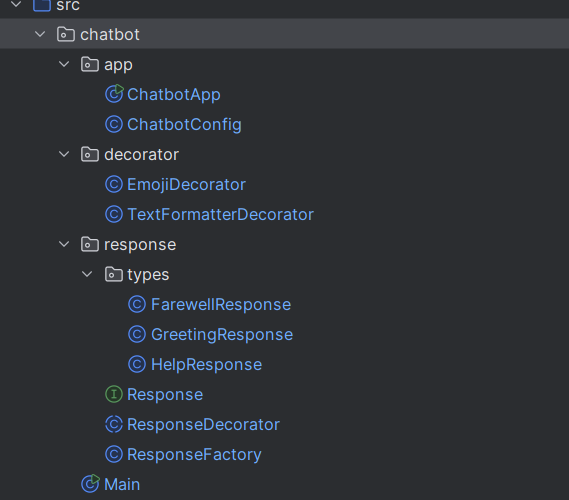

# Chatbot

## Overview

This project is a Java-based chatbot that demonstrates the implementation of various design patterns, including:

- **Factory Pattern** for dynamically creating response objects.
- **Decorator Pattern** for enhancing chatbot responses dynamically.
- **Singleton Pattern** for managing chatbot configurations globally.

The chatbot allows users to interact with predefined commands such as `greeting`, `farewell`, `help`, or `exit`. It dynamically generates responses and applies decorators for customized outputs. Users can also customize the chatbot's **name** and **mood**, with preferences saved across sessions.

---

## How to Run

1. **Clone the Repository**:

   ```bash
   git clone https://github.com/rayansamman/Chatbot.git
   ```

2. **Open the Project in IntelliJ**:

    - Ensure the project SDK is correctly configured.
    - Mark the `src` folder as "Sources Root."

3. **Run the Application**:

    - Navigate to `ChatbotApp.java`.
    - Right-click and select **Run 'ChatbotApp.main()'**.

4. **Interact with the Chatbot**:

    - Type commands like `greeting`, `farewell`, `help`, `set name`, `set mood`, or `exit` in the console.

---

# Work Progress

### This topic for keeping track and updating each other 

## My steps (Alisiia)

### 1. **Implemented Design Patterns**

- **Factory Pattern**:

    - Created a `ResponseFactory` class to dynamically generate responses based on user input.
    - Added response types like `GreetingResponse`, `FarewellResponse`, and `HelpResponse`.

- **Decorator Pattern**:

    - Added decorators like `EmojiDecorator` and `TextFormatterDecorator` to enhance responses with emojis and formatting.

- **Singleton Pattern**:

    - Implemented a `ChatbotConfig` class to manage global chatbot configurations, such as the bot's name and mood.
    - Improved the singleton pattern to ensure proper deserialization and thread safety.
    - Added functionality to load and save preferences (e.g., name, mood) in a `config.properties` file.

### 2. **Dynamic User Interaction**

- Added a user input loop in `ChatbotApp` to process commands and dynamically generate responses.
- Applied decorators to responses dynamically based on user input.
- Handled invalid commands gracefully with error messages.
- Allowed users to set the chatbot's name and mood dynamically during runtime.
- Saved user preferences across sessions using the `ChatbotConfig` class.

### 3. **Enhanced Code in ChatbotApp**

- Refactored the chatbot's main logic into reusable methods.
- Dynamically applied decorators to all responses.
- Improved the user experience with enhanced messages and error handling.
- Introduced mood-based responses (e.g., "happy", "grumpy", "neutral") to change the chatbot's tone dynamically.

---

## Features

### 1. **Commands**

- `greeting`: Returns a greeting message.
- `farewell`: Returns a farewell message.
- `help`: Displays a list of available commands.
- `exit`: Exits the chatbot application.
- `set name [name]`: Changes the chatbot's name (e.g., `set name Kato`).
- `set mood [mood]`: Changes the chatbot's mood (e.g., `set mood happy` or `set mood grumpy`).

### 2. **Dynamic Response Generation**

- Responses are generated dynamically using the `ResponseFactory`.
- All responses can be decorated with emojis and text formatting.
- Responses are adapted based on the chatbot's mood (e.g., "happy", "grumpy", "neutral").

### 3. **Singleton Configuration**

- The `ChatbotConfig` class ensures a single instance is used to manage global settings.
- Users can save preferences (name and mood) that persist across sessions using a `config.properties` file.

---

## Examples of Interaction

### Changing the Chatbot's Name
- **Input**: `set name Kato`
- **Response**: `Chatbot: You can now call me Kato!`

### Changing the Mood
- **Input**: `set mood happy`
- **Response**: `Chatbot: Mood changed to happy.`

### Greeting in Different Moods
- **Neutral Mood**:
    - **Response**: `Hello! How can I assist you?`
- **Happy Mood**:
    - **Response**: `Hey there! So happy to see you! 😊`
- **Grumpy Mood**:
    - **Response**: `Oh... it's you. What do you want? 🙄`

---

## Future Improvements

- Implement **Behavioral Patterns** like State or Observer for managing chatbot states or events.
- Add support for external APIs (e.g., jokes, weather updates).
- Enhance user input handling with NLP for smarter interactions.
- Add unit tests for better reliability using JUnit.
- Expand the chatbot's "mood" system with more dynamic behaviors (e.g., "curious", "excited").
- Add a logging system to track user interactions for analytics.

---

## Notes for Teammate 💕

- Refactored the file structure.

